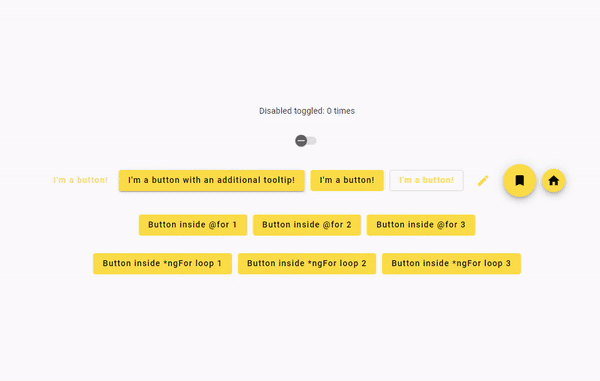
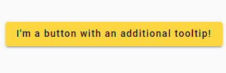
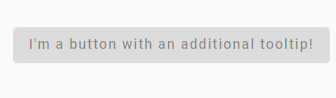
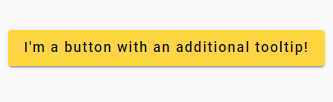
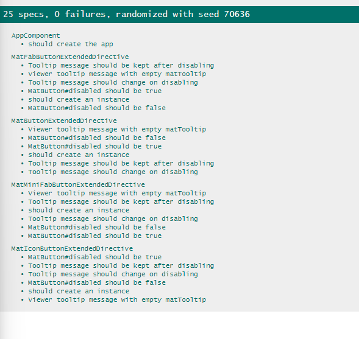

# Expand the functionality of mat-button.



## Task Description

Expand the functionality of mat-button.
The button should be inactive if the user lacks sufficient permissions.
The user should be informed about this through a pop-up tooltip.

The button should be disabled if `[isViewerDisabled]='true'`.
The tooltip text is set through a separate field (e.g., `viewerTooltip`).

The new functionality should not conflict with the existing one.
Make it possible to extend the functionality of any `mat-button`.

Additionally: Button inactivity means the appearance of the button is disabled (https://material.angular.io/components/button/overview)\
When hovering over such a button, the cursor changes to not-allowed (https://css-tricks.com/almanac/properties/c/cursor/)\
A tooltip is displayed explaining why the button is inactive.\

## Solution

The functionality is implemented by directive [appMatButtonExtended](src%2Fapp%2Fdirective%2Fa-base-mat-button-extended.directive.ts).

To use the directive you should add `appMatButtonExtended` to the button and set the necessary parameters\
Also, you need to add `matTooltip` if it's not already there.
```html
<button mat-raised-button 
        appMatButtonExtended 
        [isViewerDisabled]="buttonsDisabled()"
        [viewerTooltip]="'ViewerTooltip val: ' + cnt()" 
        [matTooltip]="'Value from matTooltip: ' + cnt()">
  I'm a button with an additional tooltip!
</button>
```

New tooltip doesn't conflict with the existing one.\


When button is inactive, the cursor changes to not-allowed and tooltip is displayed.\


On disabling the button, the tooltip is displayed for few moments.\


This directive supports the following buttons:
- mat-button
- mat-raised-button
- mat-flat-button
- mat-stroked-button
- mat-icon-button
- mat-fab
- mat-mini-fab

## Development server

Run `ng serve` for a dev server. Navigate to `http://localhost:4200/`. The application will automatically reload if you change any of the source files.

## Running unit tests

Run `ng test` to execute the unit tests via [Karma](https://karma-runner.github.io).


